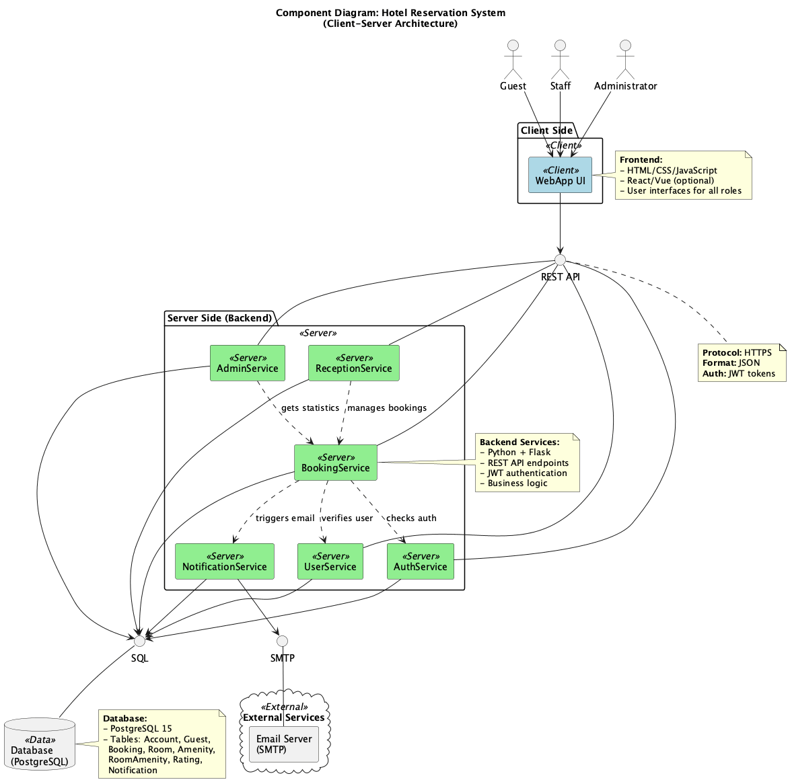

# High Level Design

## Загальний опис архітектури

Система побудована за принципом клієнт-сервер з використанням REST API. Клієнтська частина відповідає за взаємодію з користувачем: відображення даних, фільтрацію, оформлення бронювань та надсилання запитів до сервера. Серверна частина обробляє ці запити, реалізує бізнес-логіку, керує даними бронювань, користувачів та номерів, а також взаємодіє з базою даних.

## Архітектурний стиль

Обрано RESTful архітектурний стиль у поєднанні з монолітною серверною структурою. Такий підхід забезпечує простоту реалізації, легку підтримку, централізовану обробку даних та швидкий старт проєкту, не потребуючи розподілу на окремі сервіси на початковому етапі.

## Основні компоненти

### WebApp
Забезпечення взаємодії з користувачем: показує доступні кімнати, фільтрує їх, дозволяє переглядати інформацію про бронювання та надсилати дані для створення нового бронювання. Відповідно до ролі користувача (гість, співробітник рецепції, адміністратор) інтерфейс показує різний функціонал.

### Backend / Services
- **AdminService** – функціонал керування номерами (створення, редагування, видалення, зміна статусу)  
- **ReceptionService** – фільтрація бронювань по ПІБ, коду бронювання та іншим параметрам  
- **BookingService** – логіка бронювання та отримання інформації про номери  
- **UserService** – управління обліковими записами користувачів (створити, видалити, знайти по ID, отримати список усіх)  
- **AuthService** – автентифікація та авторизація користувачів   
- **NotificationService** – надсилає підтвердження бронювання, нагадування та інші повідомлення   

### Database (DB)
База даних PostgreSQL зберігає всю інформацію про:    
- користувачів (Account, Guest)  
- бронювання (Booking)  
- номери (Room, RoomAmenity, Amenity)  
- відгуки (Rating)  
- повідомлення (Notification)  

## Component Diagram

Короткий опис:  
- На діаграмі зображено основні частини системи та зв’язки між ними.
- Frontend (WebApp) надсилає запити до Backend-сервісів через REST API.
- AuthService відповідає за автентифікацію користувачів і видачу JWT токенів.
- BookingService, AdminService, ReceptionService, UserService обробляють бізнес-логіку (бронювання, керування номерами, робота з користувачами).
- Backend зберігає і отримує дані з PostgreSQL.
- Для прискорення запитів застосовується Redis (кешування).
- NotificationService відправляє повідомлення (наприклад, підтвердження бронювання) через зовнішній SMTP-сервер.

## Ключові архітектурні рішення
- Обрано PostgreSQL, оскільки дані системи мають *чітку реляційну структуру*: користувачі, бронювання, кімнати та зручності пов'язані між собою і потребують цілісності та складних запитів. 
- Серверна частина реалізовуватиметься як моноліт для простоти розробки (адже ми маємо досвід роботи з цим підходом), швидкого розгортання, *легкості інтеграції всіх компонентів у єдину систему та їхнього тестування на ранніх етапах проєкту*. 
- Додатково використано Redis для кешування часто використовуваних даних, що *підвищує швидкодію системи*, а Docker *забезпечує стабільне середовище розробки та швидке розгортання на будь-якому сервері*.

## Технологічний стек
**Frontend:** HTML, CSS, JavaScript  
**Backend:** Python, Flask  
**База даних:** PostgreSQL   
**Інше:** Docker, Redis   

## Як компоненти взаємодіють
- Frontend і Backend через REST API (HTTPS, JSON)   
- AuthService видає JWT токени, які використовуються для авторизації у всіх запитах  
- Backend сервіси (Booking, Admin, Reception, User) працюють із базою даних PostgreSQL  
- Redis використовується як кеш для зменшення навантаження на БД   
- NotificationService відправляє email-повідомлення після створення чи зміни бронювання  
