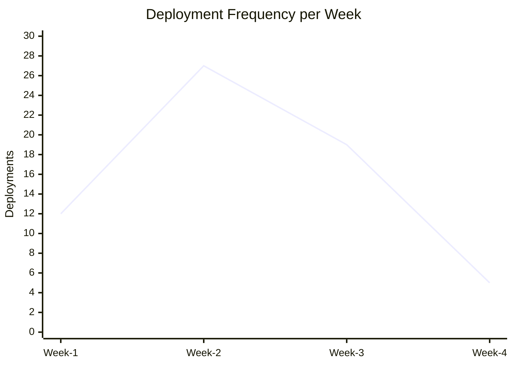
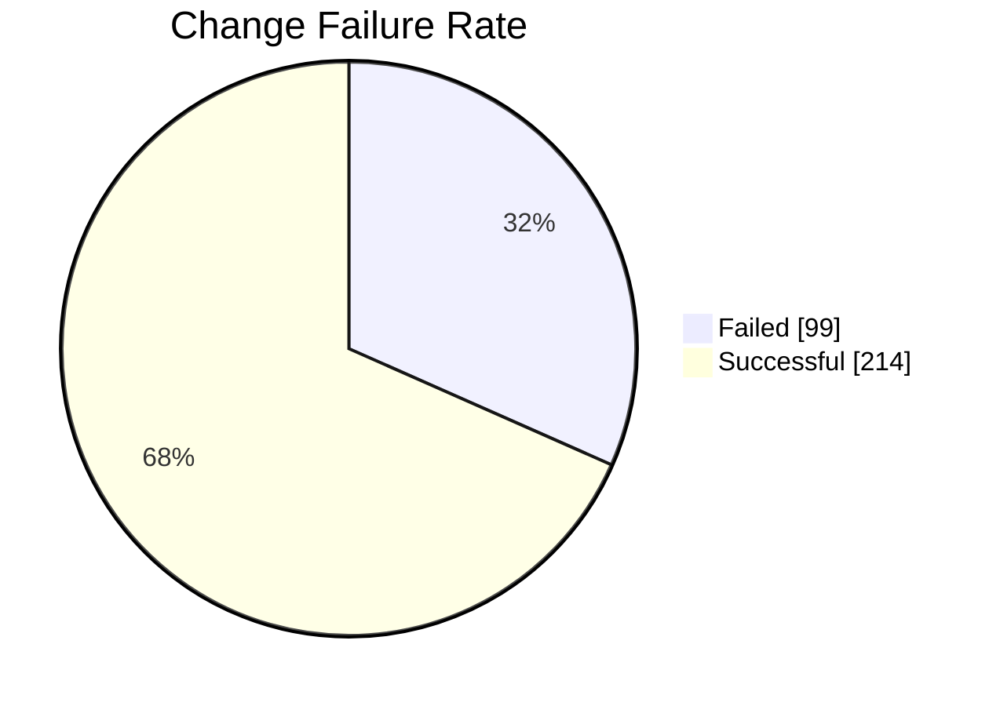
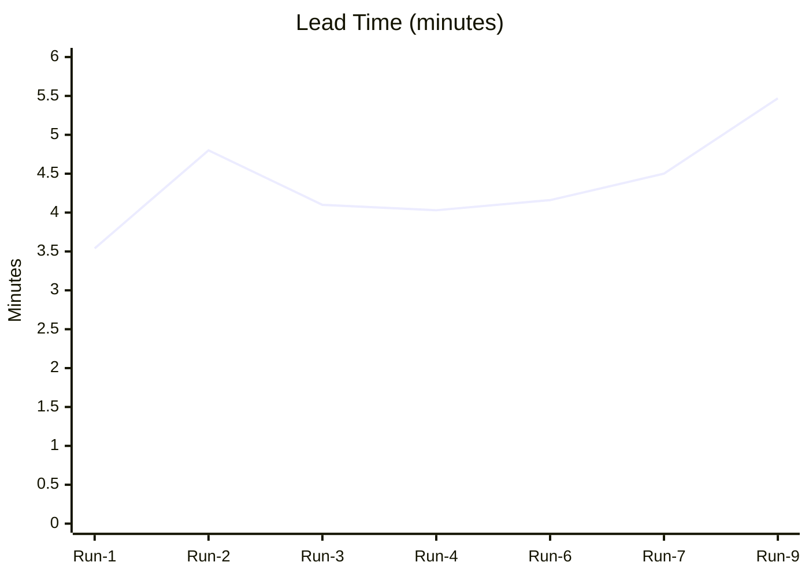
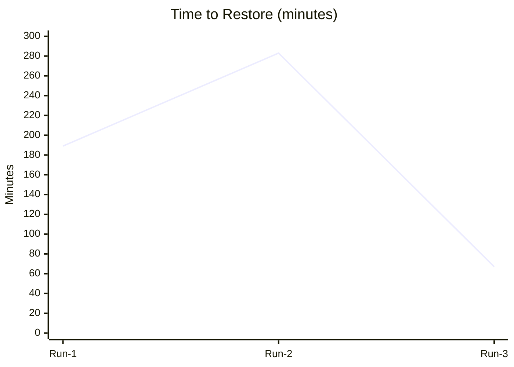

# DORA-розрахунки

| Метрика                  | Формула                                 | Наш результат             | Категорія |
|--------------------------|-----------------------------------------|---------------------------|----------|
| **Deployment Frequency** | successful deployments / week           | (12+27+19+5)/4 = **15 per week**          | **Elite** |
| **Lead Time for Changes**| mean(commit → deploy time)              | (3,54 + 4.8 + 4,1 + 4,03  + 4,16 + 4,5 + 5,47)/7 = **4.37 minutes**         | **Elite** |
| **Change Failure Rate**  | failed / total deployments × 100 %      | 99/313 × 100 % = **31.6%**                  | **Medium** |
| **Time to Restore**      | mean(time to fix failed build)          | (189 + 283 + 67) / 3 = **179.67 minutes (~3h)** | **High** |

## 1. Deployment Frequency - Частота успішннх деплоїв за останні 4 тижні

## 2. Change Failure Rate - Успішність деплоїв

## 3. Lead Time - Час від коміту до деплою (останні успішні)

## 4. Time to Restore - Середній час від провалу до відновлення (останні невдалі)

# Який біль у нашій команді показали ці метрики? 

## Загальна картина
Наш проект HelloBugs демонструє швидкість без стабільності: ми досягли категорії Elite за Deployment Frequency (15 деплоїв/тиждень) та Lead Time (4.37 хв), але платимо за це частково ціною нестабільності

## Конкретні больові точки

**Реальний біль:**
- Тести не синхронізовані з бізнес-логікою (наприклад,в Run #2)
- Рефакторинг коду (JSON parsing, error handling) ламає існуючі тести
- Відсутність pre-commit hooks — код потрапляє в CI без перевірки
- Швидкість досягається завдяки обмеженому покриттю тестами (ми ще цим займаємось)
- Відсутність паралелізації тестів у CI (5 workflows, але не оптимізовані)
- Ризик це додавання нових тестів яке може збільшити час у 2-3 рази
- Централізована відповідальність: один розробник фіксить чужі тести
- Відсутність автоматичних сповіщень — треба вручну моніторити GitHub Actions
- Складність контексту: для фіксу треба іноді розібратися в чужому коді 
- ~30% деплоїв — це фікси попередніх помилок, а не нові фічі

## Висновок
Ми рухаємося швидко, але нестабільно. Третина деплоїв провалюється через тести та відсутність локальних перевірок. Тому загальна картина така: ми доставляємо зміни часто і швидко, але нестабільність у тестах та логіці створює цикли фіксів-фіксів, і команда витрачає багато часу на відновлення після збоїв замість руху вперед.Наш CI/CD процес потребує змін: від "deploy fast" до "deploy fast AND stable"

# Improvement Backlog

| Метрика             | Проблема                                                   | Першопричина                                                                                                                                                                                                                                | Дії для покращення                                                                                                                                                                                                                                                                                                                                                                                      | Відповідальний                                      |
|:--------------------|:-----------------------------------------------------------|:--------------------------------------------------------------------------------------------------------------------------------------------------------------------------------------------------------------------------------------------|:--------------------------------------------------------------------------------------------------------------------------------------------------------------------------------------------------------------------------------------------------------------------------------------------------------------------------------------------------------------------------------------------------------|:----------------------------------------------------|
| Deployment Frequency | Категорія "Elite", залишається ризик ілюзії продуктивності | Третина деплоїв — це **виправлення попередніх помилок** або "ламаний" код, тобто навіть не завжди вдалі фікси                                                                                                                               | 1. Змістити фокус на Quality Gates: налаштувати пайплайн так, щоб деплой на Staging відбувався автоматично, тільки за умови, що пройдено Code Analysis та всі тести;    2. Впровадити Feature Flags: вмикати фічі для користувачів тільки коли вони стабільні                                                                                                                                       | Супроводжувач CI/CD                                 |
| Lead Time for Changes | Категорія "Elite", ризик сповільнення                      | Гіпотеза, що швидкість через недостатнє покриття тестами. **Додавання нових перевірок збільшить час**                                                                                                                                       | 1. Оптимізація CI/CD на випередження: вже налаштовувати паралельне виконання тестів та кешування (Docker layers), щоб майбутнє розширення тестів не сповільнило швидкість.    2. Культура маленьких PR: заохочувати атомарні коміти (Small Batches), які швидко проходять пайплайн і рев'ю                                                                                                          | Супроводжувач CI/CD та інші                         |
| Change Failure Rate | 31.53%                                                     | **Технічний борг**: старі тести не були оновлені відповідно до нової бізнес-логіки застосунку                                                                                                                                               | 1. Впровадити правило запуску `docker-compose -f docker-compose.test.yml up` перед кожним комітом. Обов'язковий рефакторинг тестів, що впали, до відправки коду в репозиторій;   2. Культурні зміни: перехід на підхід *"You build it, you run it"*, нести повну відповідальність за власні зміни в коді і дотримуватися пункту вище                                                                | Усі                                                 | 
| Time to Restore | Категорія "High" (мета: "Elite")                           | (*так як в попередньому пункті виявлено, що в більшості проблема з фейлами тестів*) **Централізований процес виправлення тестів**: Це вимагає значного часу на занурення в контекст чужого коду і стає bottleneck у процесі відновлення | 1. Автоматизувати сповіщення (Feedback Loop): налаштувати інтеграцію (Slack/Discord/Jira), щоб при падінні воркфлоу автоматично створювався Issue з тегом на автора коміту, замість ручного моніторингу розділу Actions;   2. Впровадити додаткові Branch Protection Rules: заборонити мердж Pull Request в main, доки всі тести та перевірки в CI не пройдуть успішно (*коли запустимо production) | Керівник трекера завдань, Супроводжувач репозиторію |

